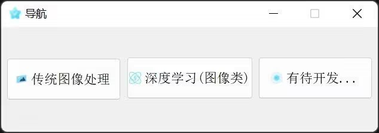

# LittleConclude
<h1><i>该项目作为个人学习总结使用</i></h1>
<h2>一些基于OpenCV入门级别的图像处理操作和一些深度学习相关的应用</h2>
<h2>构建环境:</h2>
<ul>
  <li>Visual Studio 2019</li>
  <li><a href="https://download.qt.io/archive/qt/">QT 5.14.2</a></li>
  <li><a href="https://opencv.org/releases/">OpenCV 4.6.0</a></li>
  <li><a href="https://www.intel.com/content/www/us/en/developer/tools/openvino-toolkit/download.html">OpenVINO 2022.1</a></li>
</ul>
<h1>功能:</h1>
<ul>
  <li></img></li>
</ul>
